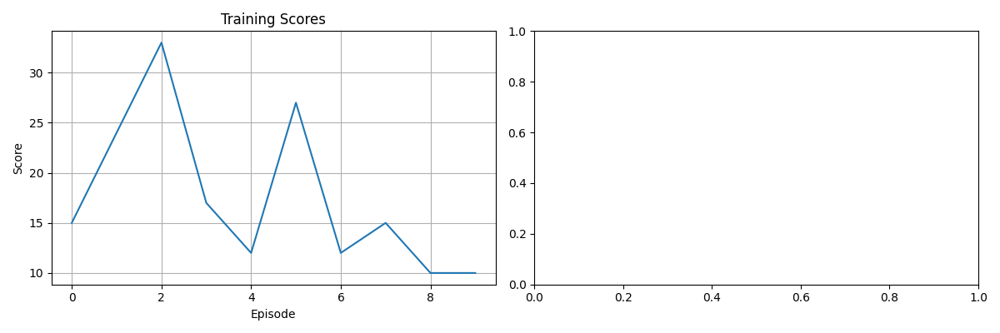

# DQN CarRacing Agent

A cleaned-up reinforcement-learning project for training a Deep Q-Network agent on Gymnasium's `CarRacing-v3` environment.

The original university prototype started as a Windows/OpenAI Gym setup experiment. This version turns the useful core into a readable portfolio project: frame preprocessing, a compact convolutional Q-network, replay memory, target-network updates, checkpointing, evaluation, and training plots.

## Why this project exists

CarRacing is a nice RL showcase because the agent does not classify a static dataset. It receives pixels, chooses actions, and slowly learns a driving policy from reward feedback.

The project demonstrates:

- visual state preprocessing from RGB frames to stacked grayscale inputs
- continuous-control environment reduced to a small discrete action set
- Deep Q-Learning with replay memory
- Double-DQN style target estimation
- epsilon-greedy exploration
- checkpointing and evaluation scripts
- training-result visualization

## Project structure

```text
src/rl_car_racing/
  agent.py          DQN agent, replay memory, epsilon-greedy policy
  model.py          compact CNN Q-network
  preprocessing.py  RGB frame → normalized 84x84 grayscale frame
  train.py          training CLI
  evaluate.py       checkpoint evaluation CLI
assets/
  training-results-sample.png
checkpoints/
  car-racing-dqn-best.pth
  car-racing-dqn-final.pth
legacy/
  original prototype scripts kept private/for reference
```

## Method

The Gymnasium CarRacing environment exposes a continuous action space. For a compact educational DQN implementation, this project discretizes it into five actions:

```text
turn left · turn right · accelerate · brake · no-op
```

Each observation is converted to grayscale, resized to `84x84`, normalized, and stacked across four frames. The Q-network predicts a value for each discrete action.

## Sample result

The current saved sample plot is from the early prototype and mainly shows that the training loop/checkpoint pipeline was running. It is not presented as a fully solved CarRacing benchmark.



## Setup

```bash
python -m venv .venv
source .venv/bin/activate  # Windows: .venv\Scripts\activate
pip install -r requirements.txt
```

CarRacing requires Box2D/SWIG support. If installation fails, install SWIG first:

```bash
# macOS
brew install swig

# then retry
pip install -r requirements.txt
```

## Train

```bash
python -m rl_car_racing.train --episodes 100
```

With live rendering:

```bash
python -m rl_car_racing.train --episodes 100 --render
```

Outputs:

```text
checkpoints/car-racing-dqn-best.pth
checkpoints/car-racing-dqn-final.pth
assets/training-results.png
```

## Evaluate

```bash
python -m rl_car_racing.evaluate --checkpoint checkpoints/car-racing-dqn-best.pth --episodes 3 --render
```

## Current limitations

This is a compact educational RL implementation, not a fully optimized CarRacing solver.

Known limitations:

- short prototype training runs are unstable
- the discrete action set is simple and leaves performance on the table
- stronger results would need longer training, better reward shaping, and video/GIF evaluation
- legacy setup scripts are kept only for historical reference and should not be treated as the main interface

## Next improvements

- add a trained-agent GIF next to a random-policy baseline
- log rewards/losses to CSV for reproducible plots
- add a small CI smoke test for model forward pass and preprocessing
- optionally move checkpoints to GitHub Releases if the public repo grows
